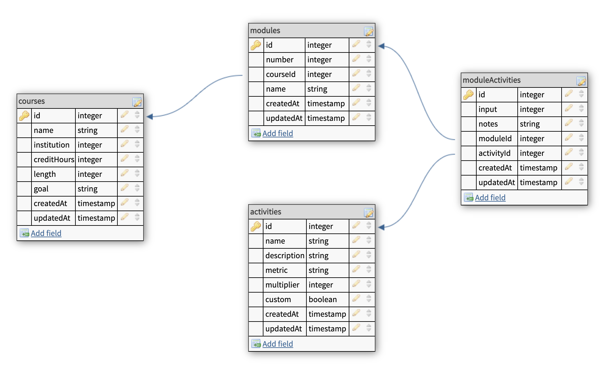

[](https://github.com/gomods/athens)
[](https://circleci.com/gh/circleci/circleci-docs)

<br />
<p align="center">
  <a href="logo.png">
    
  </a>

<h1 align="center">📊 Course Chart BE</h1>
</p>

<p align="center">
  Course Chart is an instructional design tool to assist education professionals in designing and mapping both new and existing courses. Users can build courses and modules around the amount of time students should spend on a variety of different learning activities (such as readings, lectures, and exams). Course Chart then provides graph visualizations to help ensure that work is appropriately distributed and balanced throughout the entire course. The site is intended to serve as a collaboration tool to allow instructional design and subject matter experts to work together to design optimally-balanced courses to meet the needs of both students and instructors. It can also be used to map existing courses as part of the accreditation process.
</p>

## Table of Contents
 - [About](#about)
 - [Database Schema](#database-schema)
 - [API Contract](#api-contract)
 - [Technologies Used](#technologies-used)
 - [Local Setup](#local-setup)
 - [Acknowledgements](#acknowledgements)

## About
  Like many software tools, CourseChart was born from a desire to replace a difficult-to-use spreadsheet with a more interactive and user-friendly solution. Our team worked closely with an instructional design expert to ensure that our product met the needs of professionals in the field.

  ### Key Challenges
  - Building an API in a new-to-us language and framework (our backend team is most experienced in Ruby on Rails)
  - Selecting and managing Go packages
  - Recent changes to Heroku's database connection protocol 
  - Lack of native migration functionality made migrations difficult in the production environment
  ### Key Takeaways
  - Greater understanding of both benefits and disadvantages of Ruby on Rails
  - Exposure to and appreciation of a multi-paradigm programming language
  - Experience working and communicating with teammates with different skillsets and perspectives
  - Experience working with a client 

## Database Schema



## API Contract

[API Endpoint Documentation](https://documenter.getpostman.com/view/14310262/TzJpgevK)

## Technologies Used

* [Go](https://golang.org/)
* [Gin](https://github.com/gin-gonic/gin)
* [GORM](https://gorm.io/)
* [PostgreSQL](https://www.postgresql.org/)
* [CircleCI](https://circleci.com/)
* [Heroku](https://heroku.com)

## Local Setup
  To run the project in your local environment, please follow the instructions below:

  1. Clone the repository:<br>
    `git clone git@github.com:CourseChart/upcourse-be.git`
    `cd upcourse-be`
  2. Install Go with<br>
    `brew install go`
  3. Set up the database:<br>
    a. create the databases:<br>
      `psql -c "CREATE DATABASE upcourse`<br>
      `psql -c "CREATE DATABASE upcourse_test`<br>
    b. Create a `.env` file and add the following:
      ```
      POSTGRES_USER: <your postgres username>
      POSTGRES_ADDRESS: "localhost:5432"
      POSTGRES_NAME: "upcourse"
      PORT: "8080"
      ```
      To get your postgres username, enter the following in the command line:<br>
      `psql postgres`<br>
      `\du`
    c. run the database migrations:<br>
      `go run ./migrations`<br>
  4. To launch a local server:<br>
    `go run upcourse`<br>
    Once the server is running you can send requests to `localhost:8080`<br>
    ex: `http://localhost:8080`
  5. To run tests:<br>
    `go test ./...`<br>
    or, to run tests with a detailed coverage report, run:<br>
    `go test ./testing/... -v -coverprofile cover.out -coverpkg=./...`<br>
    `go tool cover -html=cover.out`<br>

## Contributors
* [Gus Cunningham](https://github.com/cunninghamge) <a href="https://www.linkedin.com/in/grayson-cunningham/"> </a>
* [Ely Hess](https://github.com/elyhess) <a href="https://www.linkedin.com/in/ely-hess/"></a>
* [Alice Ruppert](https://github.com/srslie)  <a href="https://www.linkedin.com/in/aliceruppert/"></a>
* [Cameron Aragon](https://github.com/camaragon) <a href="https://www.linkedin.com/in/camaragon/"></a>
* [Lucas Merchant](https://github.com/lbmerchant93) <a href="https://www.linkedin.com/in/lucas-merchant93/"></a>
* [Alia Peterson](https://github.com/alia-peterson) <a href="https://www.linkedin.com/in/alia-peterson/"></a>
